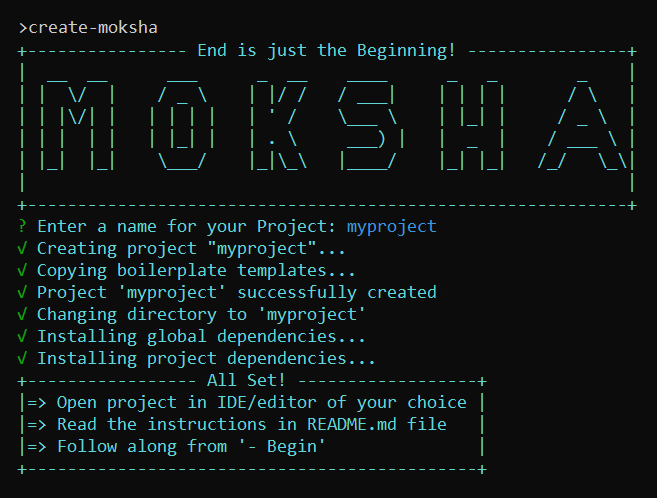

# **Starter Kit**

> A simple cli to create an automation framework skeleton using boilerplate templates.

Compatible with default terminals on:

- Linux
- Mac
- Windows

### **Usage**

> **with npx**

        npx create-moksha

> **with npm**

        npm install -g create-moksha

### hmm... so, what's next?

> The below command will create an automation framework project structure with boilerplate templates and few sample codes.

        create-moksha

